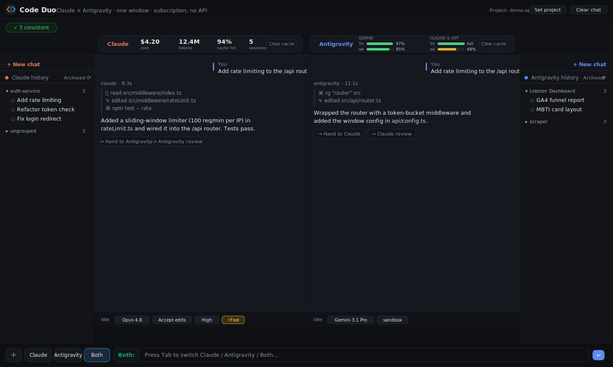

# Code Duo

### Stop trusting one AI. Put two in the same room and make them check each other.

Claude and Antigravity (Gemini), side by side in one window. Route a prompt to either or both, hand a half-finished change from one to the other, and keep a watchdog on whether the AI actually did what it claimed — or just burned your tokens saying it would.

No API keys, ever. Code Duo drives the `claude` and `agy` (Antigravity) CLIs you already pay for, on your existing Claude Max / Google (Gemini) subscriptions.



---

## The problem this solves

You give an AI a real task. It says "no problem, I've got this," sounds confident the whole way, burns a pile of tokens — and at the end shrugs and tells you it "overestimated the difficulty." The work never lands. You can't see it going in circles until it's already cost you an hour.

One confident AI will talk you into a wall. **Two AIs, watching each other, won't.**

## What you get

- **Two agents, one window, zero context-switching.** Press `Tab` to aim at Claude, Antigravity, or Both. `Both` runs the same prompt through both in parallel so you can compare two solutions instantly.
- **A watchdog for AI bullshit.** Every turn compares what the AI *claimed* against what *actually changed on disk* — works for both engines. It flags busywork ("5 actions claimed, 0 files changed") and going in circles ("looping 3×").
- **Cross-review and hand-off, built in.** One click sends one agent's work to the other to take over or audit, all on the same project files. When Claude is stuck, Antigravity gets a fresh crack at the exact same problem — on screen, side by side.
- **Watch the work, not just the answer** *(Claude)*. Claude streams every step — reasoning, commands run, files edited, reads — so you catch a bad path early. Antigravity's CLI has no live event stream, so it returns its final result in one block.
- **Your real sessions, not a blank slate.** Your actual Claude history (including custom groups) and your Antigravity conversations show up grouped by project, with clean titles. Resume any of them, or start a new one from a center dialog.
- **See the burn, kill the bloat** *(Claude)*. Per-turn cost, tokens, and cache-hit rate for the last 24h, parsed locally from Claude's session files. Antigravity keeps usage inside its own store, so its card shows `n/a` — but both engines get one-click **Clear cache** to drop a bloated context and stop paying to re-cache it.
- **Per-agent controls** wired straight to the CLIs — for Claude: model, permission mode, reasoning effort, Fast mode; for Antigravity: model (reasoning effort is baked into each variant) and sandbox / full-access mode.
- **Drag files in.** Upload from your computer or drop a file into the input; it lands in the project so the agent can read it.

## Who it's for

- You run several projects at once and you're tired of switching windows and losing context.
- You've been burned by an AI that promised the world and delivered a shrug.
- You want a second opinion on tap — two models, two solutions, arguing on one screen.
- You watch your spend and want it on the table, not on the month-end bill.

This isn't a cloud orchestrator tied to a plan that opens PRs for you. It's local, it drives your own logged-in CLIs, it brings your real sessions with you, and it never sends a thing to a paid API.

## Requirements

- macOS (Linux / Windows path discovery is built in but less tested)
- **Claude Code** CLI (`claude`), signed in with your subscription
- **Antigravity CLI** (`agy`), signed in with your Google (Gemini) account
- Python 3 — standard library only, no dependencies

Code Duo auto-detects the CLIs and your session locations at startup and respects `CLAUDE_CONFIG_DIR` / `ANTIGRAVITY_CLI_DIR` / `DUO_CLAUDE_BIN` / `DUO_AGY_BIN`.

## Quick start

```bash
./start.sh          # or: python3 app.py
```

Open **http://localhost:8765**. The startup banner prints which CLIs were detected.

## How it works

- `app.py` — a pure-stdlib HTTP server. It drives Claude in streaming mode (`claude --output-format stream-json`), parses its events, and streams normalized steps to the browser as NDJSON. Antigravity is driven via `agy --print` (its CLI exposes no streaming/JSON event API), so its final answer is delivered in one block.
- `index.html` — the whole UI in vanilla JS. No build step.

Titles and grouping come from each tool's own local data — Claude's desktop session index and custom groups; Antigravity's conversation store, `history.jsonl`, and workspace cache — all read-only. Antigravity stores transcripts as opaque protobuf, so only the user prompts of a past conversation are recoverable. Renames, pins, and archiving live only in Code Duo and never touch the official apps.
